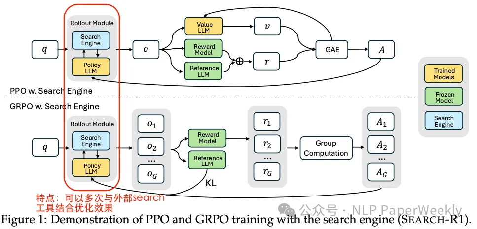

# 论文

- [Search-R1: Training LLMs to Reason and Leverage Search Engines with Reinforcement Learning](https://arxiv.org/abs/2503.09516v1)
- https://github.com/PeterGriffinJin/Search-R1

# **Methods**
**详细方法和步骤:**

- **将搜索引擎建模为环境的一部分：** SEARCH-R1将搜索引起作为环境的一部分， 让模型与环境交互，从而得到 reward。

- **支持多轮检索和推理：** SEARCH-R1通过特定的标签（`<search>`, `</search>`, `<information>`, `</information>`, `<think>`, `</think>`, `<answer>`, `</answer>`）来支持多轮检索和推理。
    

    

- **优化算法兼容性：** SEARCH-R1 与各种 RL 算法兼容，包括 PPO 和 GRPO。
- **简单结果奖励函数：** 避免复杂的基于过程的奖励, 采用简单的基于结果的奖励函数 **（字符串匹配作为reward!!!）。**
    

# **总结**

**结论1: SEARCH-R1 显著提升了LLM在需要实时外部知识的复杂推理任务中的能力。** 通过强化学习，LLM可以自主生成查询并有效利用检索到的信息，优于传统的RAG方法。

**结论2: SEARCH-R1在不同LLM架构和训练方法上具有广泛的适用性。** 实验结果表明，无论使用基础模型还是指令调整模型，SEARCH-R1都能带来显著的性能提升，且对不同的RL算法（如PPO和GRPO）具有兼容性。

**结论3: SEARCH-R1有很强的实用价值。** SEARCH-R1能够显著提高LLM在需要实时外部知识的复杂推理任务中的能力。 可以用于智能问答，智能助手等领域。

# 参考

1. [Search-R1：让大模型学会“检索+推理”的新范式](https://mp.weixin.qq.com/s/rPza0-KB4Rpc_vXyYa8xSw) 

1xx. [【论文解读】Search-R1：强化学习如何教会 LLM 自主搜索？](https://zhuanlan.zhihu.com/p/30784344002)

1xx. 有个学术的会议

1xx. [Search-R1：让 LLM 学会 “边搜边想”，强化学习赋能检索增强推理](https://mp.weixin.qq.com/s/CGkfVYWZlfSRyg_3FDQcvA)