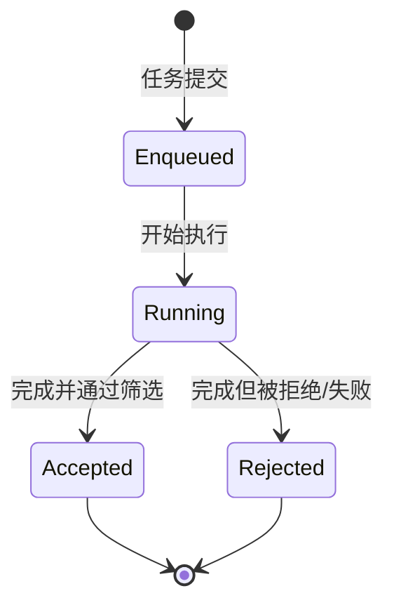
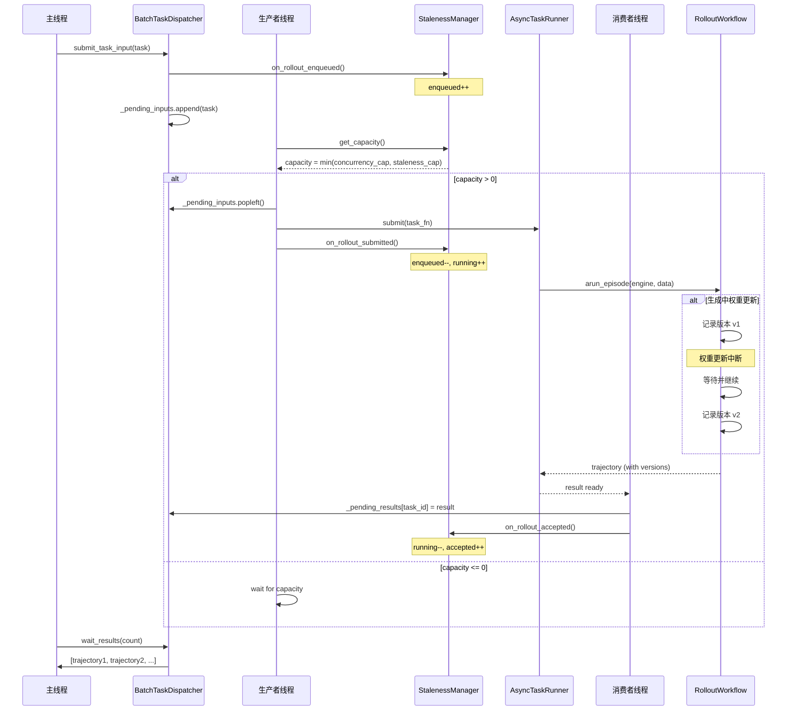
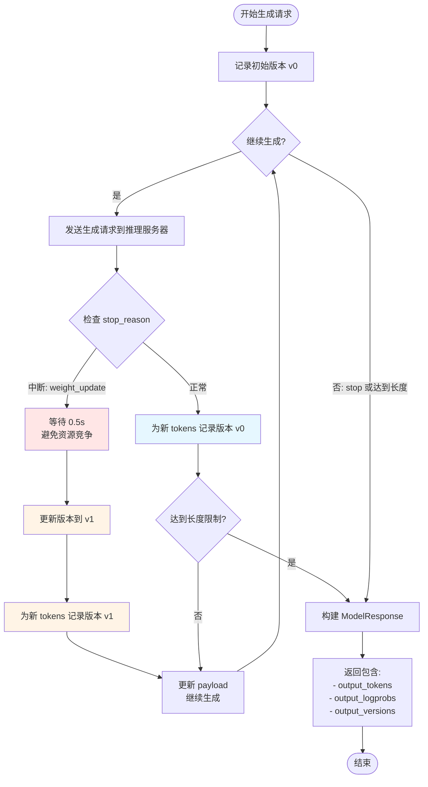
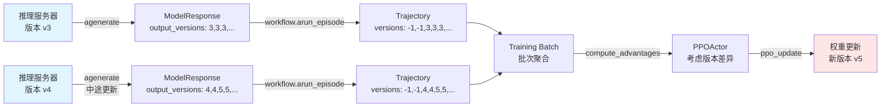

# AReaL 中的 Off-policyness 与 Partial Rollouts 实现详解

## 概述

AReaL 框架通过**异步推理和训练分离**的架构，实现了高效的分布式 RL 训练。在这个过程中，核心挑战是如何处理：

1. **Off-policyness（策略过时性）**：推理引擎使用的模型版本可能落后于训练引擎的版本
2. **Partial Rollouts（部分轨迹）**：单个生成序列可能跨越多个模型版本

本文将深入分析 AReaL 如何通过 `StalenessManager`、版本跟踪机制和 `WorkflowExecutor` 来管理这些问题。

---

## 1. Off-policyness 控制机制

### 1.1 配置参数

AReaL 通过 `max_head_offpolicyness` 参数控制允许的最大版本差：

```yaml
rollout:
  max_head_offpolicyness: 4  # 允许推理版本最多落后训练版本 4 步
```

**关键配置说明**：
- `0`：同步 RL（推理和训练完全同步，用于调试）
- `2-8`：典型异步范围（根据模型大小和更新频率调整）
- 更高值：提高吞吐量，但可能降低训练稳定性

### 1.2 StalenessManager 核心实现

`StalenessManager` 是控制 off-policyness 的核心组件，位于 `areal/core/staleness_manager.py`。

#### 1.2.1 容量计算公式

```python
def get_capacity(self) -> int:
    """计算可用的新 rollout 槽位数量"""
    with self.lock:
        current_version = self.version_provider.get_version()  # 获取当前训练版本
        
        # 并发限制容量
        max_concurrent_rollouts = max(1, self.max_concurrent_rollouts)
        concurrency_capacity = max_concurrent_rollouts - self.rollout_stat.running
        
        # 过时性限制容量
        ofp = self.max_staleness  # max_head_offpolicyness
        sample_cnt = self.rollout_stat.accepted + self.rollout_stat.running
        consumer_bs = max(1, self.consumer_batch_size)
        staleness_capacity = (ofp + current_version + 1) * consumer_bs - sample_cnt
        
        # 返回两者的最小值
        capacity = min(concurrency_capacity, staleness_capacity)
        return capacity
```

**容量计算逻辑**：

1. **并发容量**：`max_concurrent_rollouts - running_rollouts`
   - 限制同时运行的 rollout 数量
   
2. **过时性容量**：`(max_staleness + current_version + 1) × batch_size - current_samples`
   - 确保样本被消费时不会超过最大允许的过时性
   - `current_version + 1`：预测下一个训练步骤的版本
   - 乘以 `batch_size`：每个版本可以有一个完整批次的样本

3. **最终容量**：取两者最小值，确保同时满足两个约束

#### 1.2.2 Rollout 生命周期跟踪

```python
class StalenessManager:
    def on_rollout_enqueued(self):
        """Rollout 任务入队"""
        with self.lock:
            self.rollout_stat.enqueued += 1
    
    def on_rollout_submitted(self):
        """Rollout 任务提交执行"""
        with self.lock:
            self.rollout_stat.enqueued -= 1
            self.rollout_stat.running += 1
    
    def on_rollout_accepted(self):
        """Rollout 完成并被接受"""
        with self.lock:
            self.rollout_stat.running -= 1
            self.rollout_stat.accepted += 1
    
    def on_rollout_rejected(self):
        """Rollout 完成但被拒绝"""
        with self.lock:
            self.rollout_stat.running -= 1
            self.rollout_stat.rejected += 1
```

**状态转换图**：



---

## 2. Partial Rollouts（部分轨迹）实现

### 2.1 版本跟踪机制

AReaL 通过在生成过程中记录每个 token 的模型版本来支持 partial rollouts。

#### 2.1.1 ModelResponse 结构

```python
@dataclass
class ModelResponse:
    input_tokens: list[int] = field(default_factory=list)
    output_tokens: list[int] = field(default_factory=list)
    output_logprobs: list[float] = field(default_factory=list)
    output_versions: list[int] = field(default_factory=list)  # 每个 token 的版本号
    stop_reason: Literal["length", "stop", "tool_calls", "abort"] = "stop"
```

**关键字段**：
- `output_versions`：与 `output_tokens` 长度相同的列表，记录每个 token 生成时的模型版本

#### 2.1.2 增量生成与版本记录

在 `RemoteInfEngine.agenerate` 中实现增量生成：

```python
async def agenerate(self, req: ModelRequest) -> ModelResponse:
    """
    处理可能被权重更新中断的生成请求。
    如果生成过程中发生权重更新，会继续从中断处生成，
    并记录每个阶段的模型版本。
    """
    output_tokens = []
    output_logprobs = []
    output_versions = []
    stop_reason = None
    max_new_tokens = req.gconfig.max_new_tokens
    
    while stop_reason != "stop" and len(output_tokens) < max_new_tokens:
        # 如果之前被中断，等待一段时间避免资源竞争
        if stop_reason is not None:
            await asyncio.sleep(0.5)
        
        # 发送 HTTP 请求到推理服务器
        result = await arequest_with_retry(
            addr=server_addr,
            endpoint="/generate",
            payload=payload,
            method="POST"
        )
        
        # 累积输出
        new_tokens = result["output_ids"]
        output_tokens.extend(new_tokens)
        output_logprobs.extend(result["logprobs"])
        
        # 记录当前版本号（所有新生成的 token 使用相同版本）
        current_version = self.get_version()
        output_versions.extend([current_version] * len(new_tokens))
        
        # 更新请求以继续生成
        payload["input_ids"] += new_tokens
        payload["sample_params"]["max_new_tokens"] -= len(new_tokens)
        stop_reason = result.get("stop_reason")
    
    return ModelResponse(
        input_tokens=req.input_ids,
        output_tokens=output_tokens,
        output_logprobs=output_logprobs,
        output_versions=output_versions,  # 版本信息
        stop_reason=stop_reason
    )
```

### 2.2 Workflow 中的版本处理

以 `MultiTurnWorkflow` 为例，展示如何在多轮对话中累积版本信息：

```python
class MultiTurnWorkflow(RolloutWorkflow):
    async def arun_episode(self, engine: InferenceEngine, data: dict[str, Any]):
        seq, logprobs, loss_mask, versions = [], [], [], []
        
        for t in range(self.max_turns):
            # 发送生成请求
            req = ModelRequest(...)
            resp = await engine.agenerate(req)
            
            # 累积结果，注意版本信息的处理
            input_len = len(resp.input_tokens) - len(seq)
            
            # 拼接序列
            seq += resp.input_tokens[-input_len:] + resp.output_tokens
            logprobs += [0.0] * input_len + resp.output_logprobs
            loss_mask += [0] * input_len + [1] * resp.output_len
            
            # 拼接版本信息：prompt 部分标记为 -1，completion 部分使用实际版本
            versions += [-1] * input_len + resp.output_versions
            
            # 检查是否需要继续
            if reward > 0:
                break
        
        # 返回包含版本信息的轨迹
        return {
            "input_ids": torch.tensor(seq, dtype=torch.int32).unsqueeze(0),
            "logprobs": torch.tensor(logprobs, dtype=torch.float32).unsqueeze(0),
            "loss_mask": torch.tensor(loss_mask, dtype=torch.int32).unsqueeze(0),
            "versions": torch.tensor(versions, dtype=torch.int32).unsqueeze(0),  # 版本张量
            "rewards": torch.tensor(reward, dtype=torch.float32).unsqueeze(0),
            "attention_mask": torch.ones(len(seq), dtype=torch.bool).unsqueeze(0),
        }
```

**版本标记约定**：
- `-1`：prompt 部分（不需要计算损失）
- `>= 0`：completion 部分的实际模型版本号

---

## 3. 异步任务调度与分发

### 3.1 BatchTaskDispatcher 架构

`BatchTaskDispatcher` 使用生产者-消费者模式管理异步任务：

```python
class BatchTaskDispatcher[TInput: WithTaskID, TResult]:
    """
    通用的异步任务分发器，支持过时性控制。
    
    架构：
    - 生产者线程：根据过时性容量从 _pending_inputs 提交任务到 AsyncTaskRunner
    - 消费者线程：从 AsyncTaskRunner 收集结果到 _pending_results
    - 主线程：submit_task_input() 入队，wait_results() 等待结果
    """
    
    def __init__(
        self,
        max_queue_size: int,
        task_factory: Callable[[TInput], Callable[[], Awaitable[TResult | None]]],
        staleness_manager: StalenessManager,
        enable_tracing: bool = False,
    ):
        self.runner = AsyncTaskRunner(max_queue_size=max_queue_size)
        self.staleness_manager = staleness_manager
        
        # 无界队列用于生产者-消费者模式
        self._pending_inputs: deque[TInput] = deque()
        self._pending_results: dict[int, TimedResult[TResult]] = {}
        
        # 线程同步
        self._input_lock = threading.Lock()
        self._input_cv = threading.Condition(self._input_lock)
        self._result_lock = threading.Lock()
        self._result_cv = threading.Condition(self._result_lock)
```

### 3.2 生产者线程：容量感知的任务提交

```python
def _commit_loop(self) -> None:
    """生产者线程 - 根据容量持续提交任务"""
    while not self._shutdown_event.is_set():
        try:
            # 获取下一个待提交任务
            task_input = self._get_next_task_for_submission()
            if task_input is None:
                continue
            
            # 提交到 AsyncTaskRunner
            task_fn = self.task_factory(task_input)
            try:
                self.runner.submit(task_fn, task_id=task_input.task_id)
                self.staleness_manager.on_rollout_submitted()
            except TaskQueueFullError:
                # 队列满，重新入队并等待容量
                with self._input_cv:
                    self._pending_inputs.appendleft(task_input)
                    self._input_cv.wait_for(
                        lambda: self._shutdown_event.is_set() or self._has_runner_capacity()
                    )
                continue
        except Exception as e:
            self.logger.error("Producer thread failed", exc_info=True)
            self._set_thread_exception(e)
            break

def _get_next_task_for_submission(self) -> TInput | None:
    """获取下一个可提交的任务，考虑容量限制"""
    with self._input_cv:
        while not self._shutdown_event.is_set():
            # 检查是否有容量且有待处理任务
            if (
                not self.runner.paused.is_set()
                and self.staleness_manager.get_capacity() > 0  # 过时性容量检查
                and self._pending_inputs
            ):
                return self._pending_inputs.popleft()
            self._input_cv.wait()
    return None
```

### 3.3 消费者线程：结果收集

```python
def _fetch_loop(self) -> None:
    """消费者线程 - 持续从 runner 收集结果"""
    while not self._shutdown_event.is_set():
        try:
            # 轮询可用结果（非阻塞）
            output_queue_size = self.runner.get_output_queue_size()
            count = max(1, min(output_queue_size, _MAX_FETCH_BATCH_SIZE))
            
            try:
                # 使用短超时以保持响应性
                results = self.runner.wait(count=count, timeout=0.05, with_timing=True)
            except TimeoutError:
                continue
            
            # 将结果放入待处理队列
            with self._result_cv:
                for result in results:
                    self._pending_results[result.task_id] = result
                self._result_cv.notify_all()
            
            # 新容量可用，唤醒生产者
            with self._input_cv:
                self._input_cv.notify()
        except Exception as e:
            self.logger.error("Consumer thread failed", exc_info=True)
            self._set_thread_exception(e)
            break
```

---

## 4. 完整流程图

### 4.1 Off-policyness 控制流程



### 4.2 Partial Rollouts 处理流程



### 4.3 版本信息在轨迹中的流动



---

## 5. Decoupled PPO 目标函数

当启用 off-policy 训练时，AReaL 使用 Decoupled PPO 损失函数来处理版本差异。

### 5.1 配置

```yaml
actor:
  use_decoupled_loss: true      # 启用 Decoupled PPO
  recompute_logprobs: true      # 训练时重新计算 logprobs
  prox_logp_method: "recompute" # 近端策略的计算方法
```

### 5.2 三种 Log-Probability

在 Decoupled PPO 中，需要区分三种对数概率：

1. **π_behave（行为策略）**：rollout 时记录的 logprobs（从推理服务器）
2. **π_prox（近端策略）**：训练开始时的策略（作为参考点）
3. **π_θ（当前策略）**：训练过程中更新的策略

```python
class PPOActor:
    def _log_configuration(self):
        if not self.config.use_decoupled_loss:
            logger.info("Mode: Standard PPO (on-policy)")
            if self.config.recompute_logprob:
                logger.info("  old_logp (π_old): RECOMPUTED from current policy")
            else:
                logger.info("  old_logp (π_old): FROM INFERENCE (cached during rollout)")
        else:
            logger.info("Mode: Decoupled PPO (off-policy)")
            logger.info("  log_p_behave (π_behave): FROM INFERENCE (behavior policy)")
            
            method_descriptions = {
                "recompute": "RECOMPUTED via forward pass (standard decoupled PPO)",
                "loglinear": "LOG-LINEAR APPROXIMATION (no forward pass)",
                "metrics": "RECOMPUTED + APPROXIMATION METRICS (for evaluation)",
            }
            logger.info(f"  Proximal policy (π_prox): {method_descriptions[config.prox_logp_method]}")
            logger.info("  log_p_theta (π_θ): TRAINING FORWARD PASS (current policy)")
```

### 5.3 Decoupled 损失计算

```python
def ppo_actor_loss_fn(...):
    if use_decoupled_loss:
        # 计算行为策略的重要性权重
        log_ratio_behav = logp_theta - log_p_behave
        ratio_behav = torch.exp(log_ratio_behav)
        
        # 计算近端策略的比率（用于 PPO clip）
        log_ratio_prox = logp_theta - prox_logp
        ratio_prox = torch.exp(log_ratio_prox)
        
        # Decoupled PPO 目标
        surr1 = ratio_behav * advantages
        surr2 = torch.clamp(ratio_prox, 1.0 - eps_clip, 1.0 + eps_clip) * advantages
        policy_loss = -torch.min(surr1, surr2)
    else:
        # 标准 PPO
        log_ratio = logp_theta - old_logp
        ratio = torch.exp(log_ratio)
        
        surr1 = ratio * advantages
        surr2 = torch.clamp(ratio, 1.0 - eps_clip, 1.0 + eps_clip) * advantages
        policy_loss = -torch.min(surr1, surr2)
```

---

## 6. 系统整体流程图

```mermaid
graph TB
    subgraph "1. 初始化阶段"
        Init[初始化推理引擎和训练引擎]
        Init --> LaunchServer[启动推理服务器<br/>SGLang/vLLM]
        LaunchServer --> CreateSM[创建 StalenessManager<br/>max_staleness=4]
        CreateSM --> CreateDispatcher[创建 BatchTaskDispatcher]
        CreateDispatcher --> StartThreads[启动生产者/消费者线程]
    end
    
    subgraph "2. 训练循环"
        TrainStep[训练步骤 step]
        TrainStep --> PrepareBatch[actor.prepare_batch<br/>收集 rollout 数据]
        
        PrepareBatch --> CheckCapacity{检查容量}
        CheckCapacity -->|capacity > 0| SubmitTask[提交 rollout 任务]
        CheckCapacity -->|capacity <= 0| WaitCapacity[等待容量释放]
        WaitCapacity --> CheckCapacity
        
        SubmitTask --> RunWorkflow[执行 workflow.arun_episode]
        RunWorkflow --> GenTokens[生成 tokens<br/>记录版本信息]
        
        GenTokens --> CheckUpdate{权重更新中断?}
        CheckUpdate -->|是| WaitUpdate[等待更新完成<br/>继续生成]
        WaitUpdate --> GenTokens
        CheckUpdate -->|否| CompleteGen[完成生成]
        
        CompleteGen --> BuildTraj[构建轨迹<br/>包含版本张量]
        BuildTraj --> AcceptReject{通过筛选?}
        AcceptReject -->|是| CollectBatch[收集到批次]
        AcceptReject -->|否| DiscardTraj[丢弃轨迹]
        
        CollectBatch --> BatchReady{批次就绪?}
        BatchReady -->|否| CheckCapacity
        BatchReady -->|是| ComputeAdv[计算 Advantages]
        
        ComputeAdv --> PPOUpdate[PPO 更新<br/>Decoupled Loss]
        PPOUpdate --> UpdateLR[更新学习率]
        UpdateLR --> SyncWeights[同步权重到推理服务器]
        SyncWeights --> IncVersion[增加版本号<br/>version++]
        IncVersion --> NextStep[下一步]
        NextStep --> TrainStep
    end
    
    subgraph "3. 并发控制"
        SM[StalenessManager]
        SM --> CalcCap[计算容量<br/>min(concurrency, staleness)]
        CalcCap --> TrackState[跟踪 rollout 状态<br/>enqueued/running/accepted]
    end
    
    StartThreads --> TrainStep
    PrepareBatch -.调用.-> SM
    IncVersion -.更新.-> SM
    
    style CheckUpdate fill:#ffe6e6
    style WaitUpdate fill:#ffe6e6
    style GenTokens fill:#e6f7ff
    style SyncWeights fill:#fff4e6
    style IncVersion fill:#fff4e6
```

---

## 7. 关键设计要点总结

### 7.1 Off-policyness 控制

1. **双重容量限制**：
   - 并发限制：控制同时运行的 rollout 数量
   - 过时性限制：确保样本不会过时到超过可接受范围

2. **版本感知调度**：
   - 生产者线程在提交任务前检查 `staleness_manager.get_capacity()`
   - 容量计算考虑当前版本和最大允许的版本差

3. **状态跟踪**：
   - 使用线程安全的计数器跟踪 rollout 生命周期
   - 实时更新 `enqueued`、`running`、`accepted`、`rejected` 状态

### 7.2 Partial Rollouts 支持

1. **增量生成**：
   - `agenerate` 方法支持中断和恢复
   - 每次生成一段 tokens 后检查是否需要继续

2. **版本记录**：
   - `output_versions` 列表与 `output_tokens` 一一对应
   - 记录每个 token 生成时的模型版本

3. **版本传播**：
   - 从 `ModelResponse` → `Workflow` → `Trajectory` → `Training Batch`
   - 训练时可以利用版本信息调整损失计算

### 7.3 异步架构优势

1. **高吞吐量**：
   - 推理和训练并行执行
   - 典型情况下比同步 RL 快 2 倍

2. **GPU 利用率高**：
   - 推理 GPU 持续生成数据
   - 训练 GPU 持续更新模型

3. **灵活的容错**：
   - 支持中断和恢复
   - 拒绝的 rollout 不会阻塞训练

---

## 8. 配置建议

### 8.1 调试场景

```yaml
rollout:
  max_head_offpolicyness: 0  # 完全同步，便于调试
  max_concurrent_rollouts: 1
  
actor:
  use_decoupled_loss: false
  recompute_logprob: true
```

### 8.2 高吞吐量场景

```yaml
rollout:
  max_head_offpolicyness: 6   # 允许更多异步
  max_concurrent_rollouts: 128
  consumer_batch_size: 32
  
actor:
  use_decoupled_loss: true
  recompute_logprob: true
  prox_logp_method: "loglinear"  # 使用近似避免额外前向传播
```

### 8.3 稳定性优先场景

```yaml
rollout:
  max_head_offpolicyness: 2   # 较小的异步度
  max_concurrent_rollouts: 32
  
actor:
  use_decoupled_loss: true
  recompute_logprob: true
  prox_logp_method: "recompute"  # 精确计算近端策略
```

---

## 9. 参考资料

- **代码位置**：
  - `areal/core/staleness_manager.py`: Off-policyness 控制
  - `areal/core/workflow_executor.py`: 任务调度和执行
  - `areal/core/remote_inf_engine.py`: 推理引擎和增量生成
  - `areal/engine/ppo/actor.py`: Decoupled PPO 实现

- **文档**：
  - [Asynchronous RL Guide](docs/algorithms/async.md)
  - [GSM8K GRPO Example](docs/lite/gsm8k_grpo.md)
  - [AReaL Paper](https://arxiv.org/pdf/2505.24298)

---

## 附录：代码示例

### A.1 完整的训练循环示例

```python
# 初始化
rollout = RemoteSGLangEngine(config.rollout)
rollout.initialize(train_data_parallel_size=parallel_strategy.dp_size)

actor = FSDPPPOActor(config=config.actor)
actor.create_process_group(parallel_strategy=parallel_strategy)
actor.initialize(None, ft_spec)
actor.connect_engine(rollout, weight_update_meta)

# 训练循环
for global_step in range(max_steps):
    # 1. 收集 rollout 数据（异步）
    batch = actor.prepare_batch(
        train_dataloader,
        group_size=config.gconfig.n_samples,
        workflow=workflow,
        should_accept_fn=lambda sample: True,
    )
    # batch 包含 'versions' 字段，形状 [batch_size, seq_len]
    
    # 2. 重新计算 logprobs（如果需要）
    if config.actor.recompute_logprob:
        logp = actor.compute_logp(batch)
        batch["prox_logp"] = logp
    
    # 3. 计算参考 logprobs（用于 KL 惩罚）
    if ref is not None:
        batch["ref_logp"] = ref.compute_logp(batch)
    
    # 4. 计算 Advantages
    actor.compute_advantages(batch)
    
    # 5. PPO 更新
    actor.ppo_update(batch)
    actor.step_lr_scheduler()
    
    # 6. 同步权重到推理服务器
    rollout.pause()  # 暂停 rollout 避免竞争
    actor.update_weights(weight_update_meta)
    actor.set_version(global_step + 1)
    rollout.set_version(global_step + 1)
    rollout.resume()  # 恢复 rollout
    
    # 7. 日志和评估
    if global_step % eval_interval == 0:
        evaluator.evaluate(actor, valid_dataloader, global_step)
    saver.save(actor, global_step)
```

### A.2 自定义 Workflow 示例

```python
class CustomWorkflow(RolloutWorkflow):
    async def arun_episode(self, engine: InferenceEngine, data: dict[str, Any]):
        # 准备输入
        input_ids = self.tokenizer.apply_chat_template(
            data["messages"], tokenize=True, add_generation_prompt=True
        )
        
        # 生成响应（支持 partial rollouts）
        req = ModelRequest(
            rid=uuid.uuid4().hex,
            input_ids=input_ids,
            gconfig=self.gconfig,
            tokenizer=self.tokenizer,
        )
        resp = await engine.agenerate(req)
        
        # 计算奖励
        prompt_str = self.tokenizer.decode(resp.input_tokens)
        completion_str = self.tokenizer.decode(resp.output_tokens)
        reward = await self.async_reward_fn(prompt_str, completion_str, **data)
        
        # 构建轨迹（包含版本信息）
        seq = resp.input_tokens + resp.output_tokens
        logprobs = [0.0] * resp.input_len + resp.output_logprobs
        loss_mask = [0] * resp.input_len + [1] * resp.output_len
        versions = [-1] * resp.input_len + resp.output_versions  # 关键：传播版本信息
        
        return {
            "input_ids": torch.tensor(seq, dtype=torch.int32).unsqueeze(0),
            "logprobs": torch.tensor(logprobs, dtype=torch.float32).unsqueeze(0),
            "loss_mask": torch.tensor(loss_mask, dtype=torch.int32).unsqueeze(0),
            "versions": torch.tensor(versions, dtype=torch.int32).unsqueeze(0),
            "rewards": torch.tensor(reward, dtype=torch.float32).unsqueeze(0),
            "attention_mask": torch.ones(len(seq), dtype=torch.bool).unsqueeze(0),
        }
```
