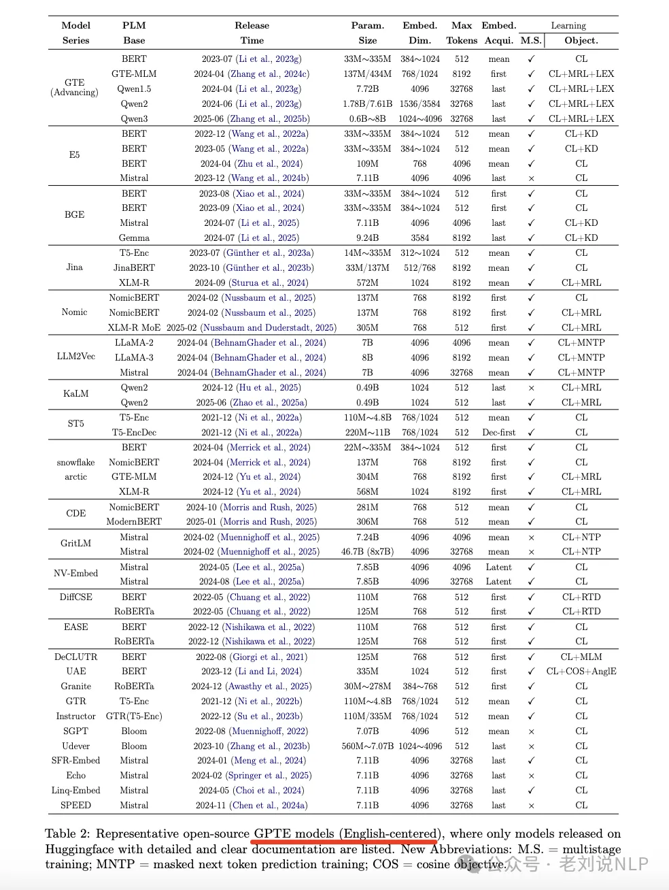

# 论文  
+ 论文地址  
  [On The Role of Pretrained Language Models in General-Purpose Text Embeddings: A Survey](https://arxiv.org/pdf/2507.20783)   

# 通用文本嵌入（GPTE）模型的典型架构和训练方式

# 通用文本embedding的代表模型及参数

# 参考
[Embedding的9点总结-从架构、数据到代表模型](https://mp.weixin.qq.com/s/HHtQrIfCyvx0HJTNbM5tuA)
