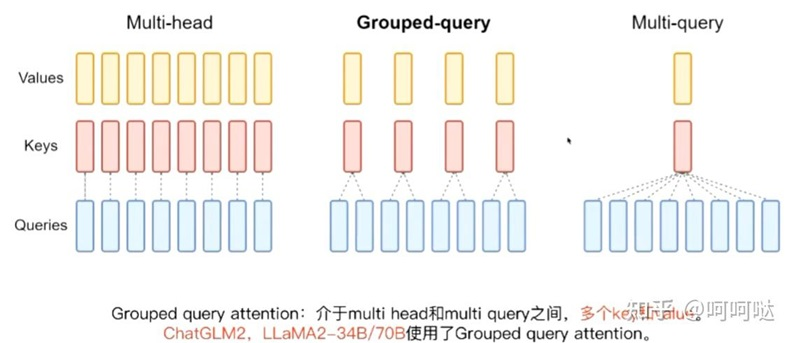

<!-- more -->

# 论文

[GQA: Training Generalized Multi-Query Transformer Models from Multi-Head Checkpoints](https://arxiv.org/pdf/2305.13245)

# **MHA vs. MQA vs.** GQA [1]

### **MHA**

首先是原始的 **MHA(Multi-Head Attention)**，QKV 三部分有相同数量的头，且一一对应。每次做 Attention，head1 的 QKV 就做好自己运算就可以，输出时各个头加起来就行。

### **MQA**

而 **MQA** 则是，让 **Q 仍然保持原来的头数**，但 **K 和 V 只有一个头**，相当于所有的 Q 头共享一组 K 和 V 头，所以叫做 Multi-Query 了。实现改变了会不会影响效果呢？确实会影响但相对它能带来的收益，性能的些微降低是可以接受的。

能带来多大的收益呢，实验发现一般能提高 30%-40% 的吞吐。

收益主要就是由降低了 KV cache 带来的。实际上 MQA 运算量和 MHA 是差不多的，可理解为**读取一组 KV 头**之后，**给所有 Q 头用**，但因为之前提到的内存和计算的不对称，所以是有利的。

### GQA

而 **GQA** 呢，是 MHA 和 MQA 的折衷方案，既不想损失性能太多，又想获得 MQA 带来的推理加速好处。具体思想是，不是所有 Q 头共享一组 KV，而是**分组一定头数 Q 共享一组 KV**，比如上面图片就是两组 Q 共享一组 KV。

MQA 和 GQA 形式在推理加速方面，主要是通过两方面来完成：

1. **降低了从内存中读取的数据量**，所以也就减少了计算单元等待时间，提高了计算利用率；
2. KV cache 变小了 head_num 倍，也就是显存中需要保存的 tensor 变小了，**空出来空间就可以加大 batch size**，从而又能提高利用率。

如果要用 MQA 和 GQA，可以是从头训练的时候就加上，也可以像 GQA 论文里面一样，用已有的开源模型，挑一些头取个 mean 用来初始化 MQA 或 GQA 继续训练一段时间。

# GQA & MQA  [2]

图 4.1 Multi-head attention 拥有 H 个查询、键和值头。Multi-query attention 在所有 查询头之间共享单个键和值头。Grouped-query attention 则在每个查询头组之间共享单 个键和值头，从而在多头和多查询注意力之间进行插值。

Fig. 4.1 Multi-head attention has H query, key, and value heads. Multi-query attention shares single key and value heads across all query heads. Grouped-query attention instead shares single key and value heads  for each group of query heads, interpolating between multi-head and multi-query attention.

# 参考

1. [为什么现在大家都在用 MQA 和 GQA？](https://zhuanlan.zhihu.com/p/647130255)  ***

2. [LLM学习系列1：大模型架构要点总结](https://zhuanlan.zhihu.com/p/648050614)
   [主流大语言模型的技术原理细节](https://cloud.tencent.com/developer/article/2328541) *** 腾讯 [架构] + 训练 + 微调

1xx. [理解Attention:从起源到MHA,MQA和GQA](https://zhuanlan.zhihu.com/p/686149289) ***
1xx. [深度解析Group Query Attention(GQA)为什么能给LLM decoder带来极大推理加速](https://zhuanlan.zhihu.com/p/667259791)
1xx. [深度学习中的注意力机制：MHA、MQA和GQA](https://zhuanlan.zhihu.com/p/683422108)

1xx. [【研1基本功 （真的很简单）Group Query-Attention】大模型训练必备方法——bonus(位置编码讲解)](https://www.bilibili.com/video/BV15f421Q7Hg/)    v   *** Nomolization[post, pre, *sandwich*] + Position Encoding[RoPE] + **GQA代码**
 1xx. [一文通透各种注意力：从多头注意力MHA到分组查询注意力GQA、多查询注意力MQA](https://blog.csdn.net/v_JULY_v/article/details/134228287) 删除

[手写大模型组件之Group Query Attention，从 MHA，MQA 到 GQA](https://yuanchaofa.com/hands-on-code/hands-on-group-query-attention-and-multi-query-attention.html) 
