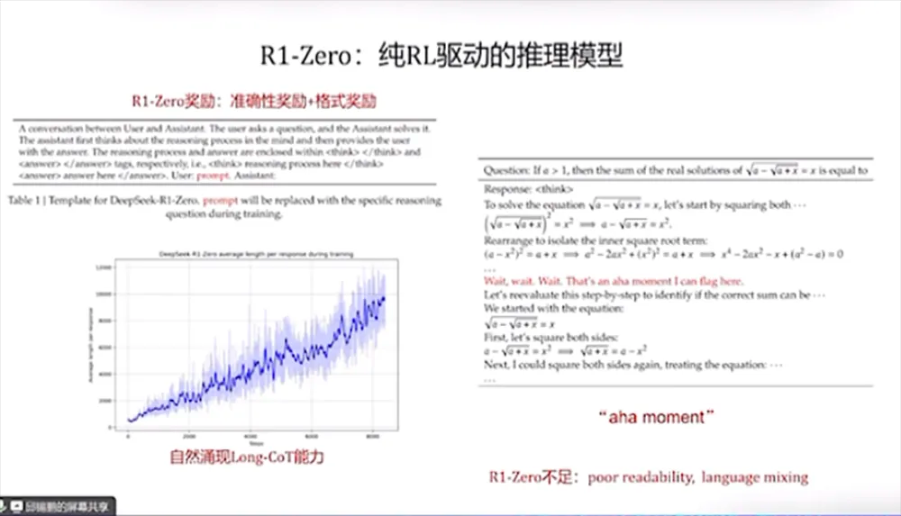
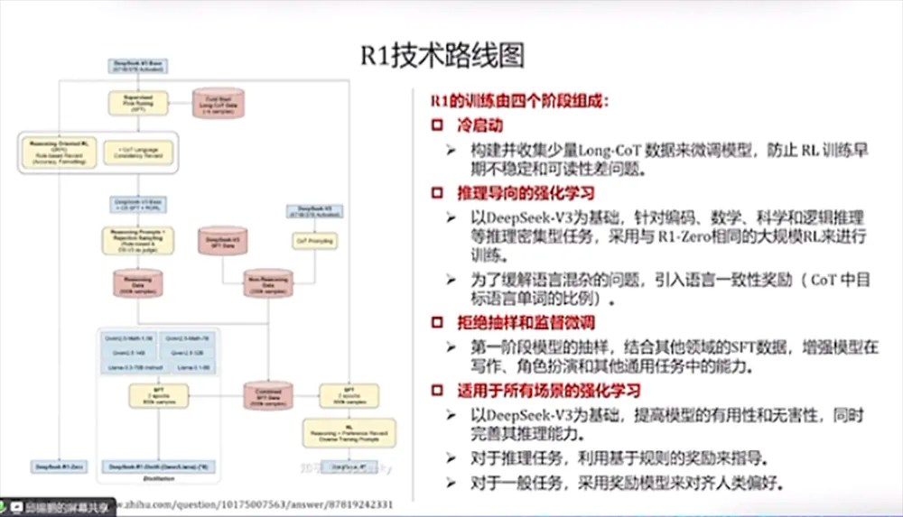
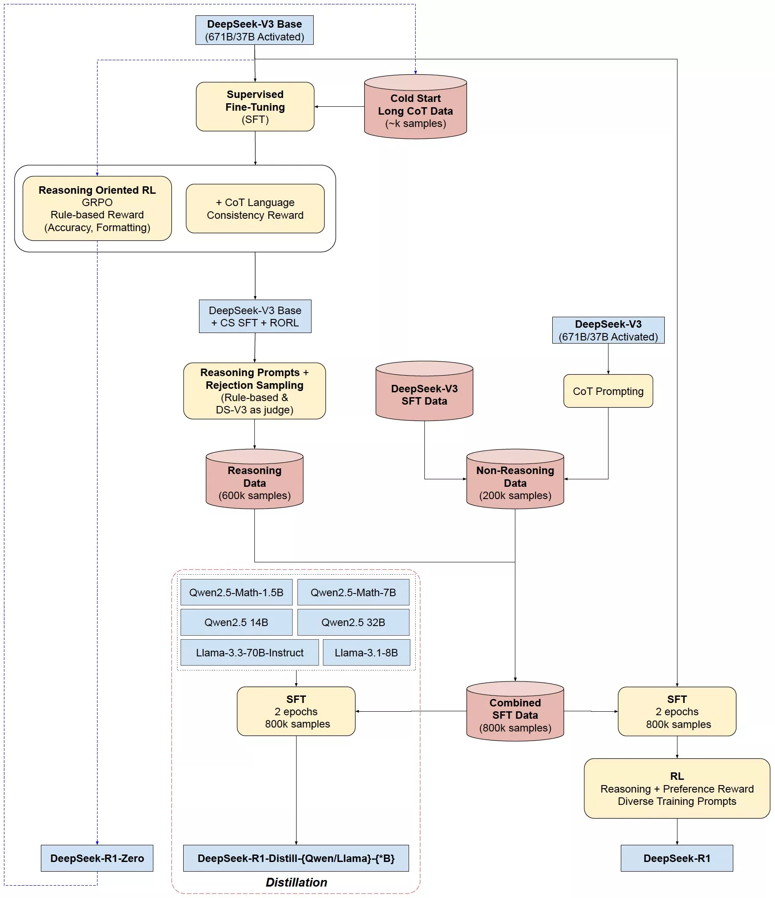

  

  
  

这基本上就是R1的技术路线。我简单列一些**关于DeepSeek R1的思考和启发**：

**1、R1/R1-zero的技术路线和社区对o1复现的差异**

- 此前社区对o1的复现基本都会涉及到蒸馏和搜索。
- R1-Zero没有SFT，没有过程监督，没有搜索，也能训练出类似o1的效果。学术界之前也有很多实验，但在较小的模型上都没有成功。说明只有基模型足够强，Scaling RL才能取得比较好的效果。
- 虽然R1强调MCTS没有效果，但是简单的majority vote能大幅提升R1的效果，说明搜索仍然是重要的Scale的范式。
- R1的成功还依赖DeepSeek强大的系统效率和RL调教能力。

**2、策略初始化**

- R1-zero是一个比较好的尝试，但是R1还是经过了先SFT（大概几干条）后再进行RL。
- 未来后训练的重心会逐步倾向于RL，但是少量训练用于SFT可能还是必须的。

**3、奖励模型**

- R1的奖励设计跟普通的后训练没特别大的区别（Qwen2，Tulu3），有ground truth用ground truth做EM，否则用RM。
- RM的（训练数据量，模型大小，OOD问题，选代周期）的相关问题在整个训练的流程中还是比较关键。可能使用当前开源的比较强大的RM可以达到比较好的效果，也有可能基于内部的数据重新进行了偏好标注。
- 奖励设计（例如RPM的技巧）可能会在基于少量样本的强化学习微调上仍然起到显著作用。

**4、PRM和MCIS**

- DS给了两个PRM和MCTS的“不成功尝试”。但PRM部分说的比较笼统，并且DS的PRM只评估Correctness（与OAI的Lets verify step by step一致）。
- R1给的是一个简单而且可规模化的可行解，这样做不一定是最优的。基于R1的Test-time search也继续优化它的效果。
- PRM总归是一种比较稠密的监督信号，按照传统R1的理论，对OR进行shaping可以使训练更稳定或收敛得更快。
- PRM不应该是一个被完全放弃的东西，可以让模型收敛得更快速或更稳定（Scaling曲线的斜率更大）。

**5、写作能力提升**

- o1相比4o在写作等任务上的提升非常小，但R1的创作经常会令人眼前一亮，可能主要是强基模型在Scale RL后涌现的能力，也有人猜测是因为R1的安全对齐做的比较少，没有太约束模型的创作能力。

**6、过度优化问题**

- R1经常会使用一些高端词汇，典型的如量子纠缠和熵增熵减（会用在各个领域）。猜测是某种形式的reward hacking导致的。
- R1在一些通用领域没有ground truth的任务上的推理效果还并不理想，强化学习的训练并不能保证泛化。

**7、Test-Time Scaling**

- o1出来后大家讨论比较多的是Test-Time Scaling，但重要的还是Training-Time Scaling，包括数据和Training
Step。蒸馏见效快，但上限不高，重要的还是高质量致据的缺失，蒸馏数据无法提供训练Scaling。RL是其中的关键，因为它可以保障有足够的数据和足够的训练步骤。

**8、Agentic展望**

- R1是目前**唯一同时具有强推理能力和联网搜索的产品**，效果很好，可以调研一些复杂的信息并进行回答。**强推理模型最终的落脚点大概率是Agent**，怎么用强推理模型帮助Agent更好更鲁棒是一个比较重要的问题。

# 参考

[DeepSeek最强专业拆解来了，清交复教授超硬核解读](https://mp.weixin.qq.com/s/LsMOIgQinPZBnsga0imcvA)

