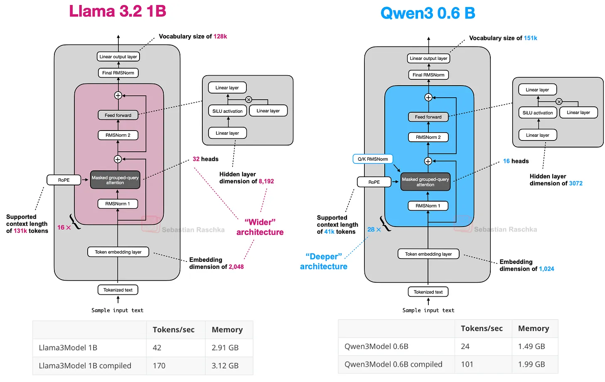
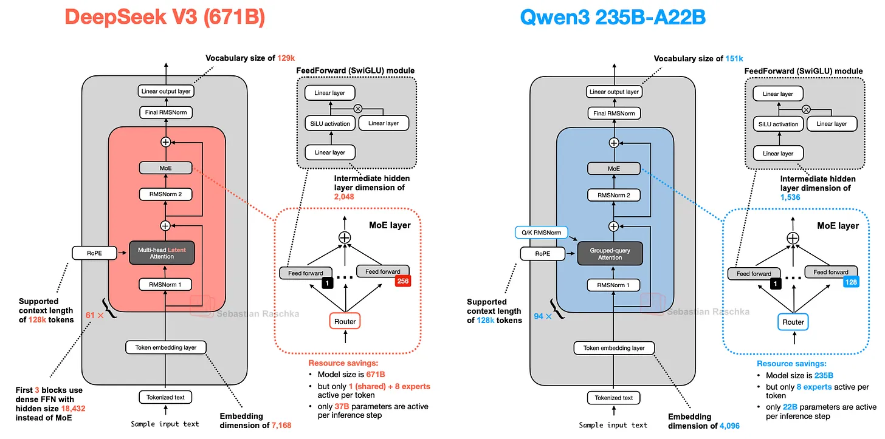
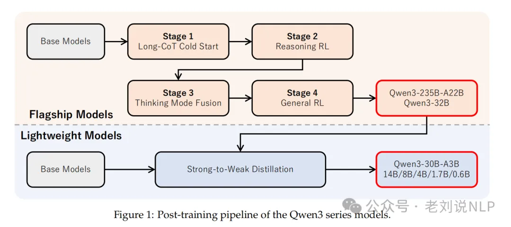

# 论文
https://github.com/QwenLM/Qwen3/

# Arch

# Post-training

###  **阶段三：思考模式融合**
**两种模式使用/think和/no_think标志进行区分，**注意“非思考模式”也有开始<think>和结束</think>的标志符，**只是其思考过程置为空**。并且在训练过程中，会针对多轮对话进行“思考”和“非思考”模式的混合训练。

#  参考
[The Big LLM Architecture Comparison](https://magazine.sebastianraschka.com/p/the-big-llm-architecture-comparison)

[Qwen3技术报告的几点细节、ArXiv论文翻译实现方案及试错历程](https://mp.weixin.qq.com/s/-4H-GhqWIpoBYvJ2M7_8DQ)

[【LLM4】Qwen3-RL训练详解](https://zhuanlan.zhihu.com/p/1921218299133396032)