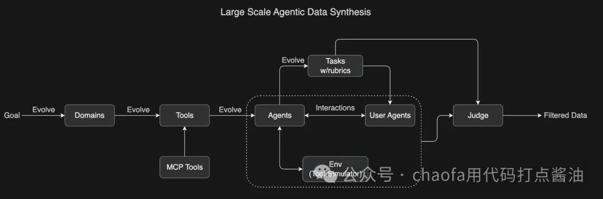
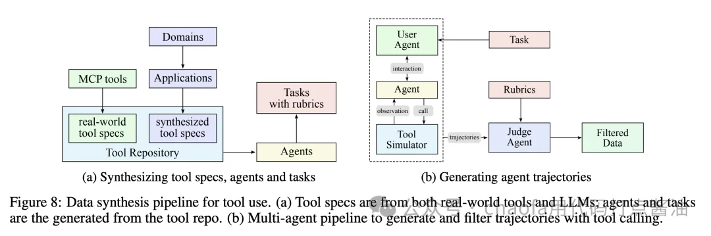

## 0. 背景

**核心关注三个问题**：

1. **预训练阶段**：如何用 MuonClip 优化器实现更高的 token 效率？
2. **后训练阶段**：如何通过大规模 Agentic 数据合成和通用强化学习，让模型学会使用工具？
3. **Test-Time Scaling**：如何让模型在推理时进行长程思考和工具调用？

## 1. 整体架构：从 K2 到 K2 Thinking

### 1.2 K2 Thinking：加入 Test-Time Scaling

Kimi K2 Thinking 是在 K2 的基础上，通过额外的训练，让模型具备了 thinking 能力。它的核心特点是：

1. 边思考边使用工具：模型在推理过程中，会进行 `think → search → browse → think → code` 的循环，动态生成和验证假设
2. 长程推理：可以执行 200-300 步连续的工具调用，保持推理的连贯性。（这点是让人比较惊喜的）
3. Test-Time Scaling：通过增加推理时的 thinking tokens 和工具调用步数，提升模型性能

从架构上看，`K2 Thinking = K2 + Thinking Ability + Test-Time Scaling`。因此，**理解 K2 的训练方法，就能理解 K2 Thinking 的 80%**。

## 2. 预训练

### 2.1 基于 MuonClip 优化器的 Token 效率优化

### 2.2 文本的改写优化

K2 相比 K1.5 的一个关键进步是引入了**合成数据生成策略**来提高 token 利用率。核心思想是：通过精心设计的改写 pipeline，在不引入显著过拟合的情况下，扩大高质量 tokens  的数量。<u>改写（Rephrasing）</u> 就是数据合成的一种方式，主要是为了提高「高质量数据的占比」，尤其是「知识领域」和「数学领域」。：

#### 2.2.1 知识领域数据改写

#### 2.2.2 数学领域数据改写

## 3. 后训练(重点)

K2 的增强 Agentic 能力源于两个重要方面：

- **大规模 Agentic 数据合成**
- **通用强化学习**

### 3.1 大规模 Agentic 数据合成：教会模型使用工具

#### 3.1.1 数据合成流程

具体流程如下：

1. 定义领域和工具：涵盖各种真实场景，如数据分析、网页开发、系统管理等
2. 生成任务：所有任务都是基于 rubric 的（有明确的评分标准），确保一致的评估
3. 模拟交互：Agents 与模拟环境和用户 agents 交互，创建真实的多轮工具使用场景
4. LLM 评判(LLM as judge)：根据任务 rubrics 评估模拟结果，过滤出高质量的训练数据

这个可扩展的 pipeline 生成了**多样化、高质量的数据**，为大规模拒绝采样和强化学习铺平了道路。

### 3.2 通用强化学习：<u>不可验证奖励</u>

传统的强化学习主要应用于**可验证奖励**的任务，比如数学题（答案对错明确）和竞赛编程（能否通过测试用例）。但对于**不可验证奖励**的任务（如写研究报告、创意写作），传统 RL 就无能为力了。

#### 3.2.1 Self-Judging 机制

核心思想是：**模型作为自己的评判者**，为不可验证的任务提供可扩展的、基于 rubric 的反馈。

具体做法：

1. 对于不可验证的任务，模型生成多个候选答案
2. 模型自己根据 rubric 评估这些答案，给出分数
3. 使用这些分数作为奖励信号，进行强化学习

#### 3.2.2 用可验证奖励改进 Critic

**小结**：通过大规模 Agentic 数据合成和通用强化学习，K2 学会了在各种场景下使用工具，并且能够处理可验证和不可验证的任务。这为 K2 Thinking 的长程推理能力打下了基础。

## 4. K2 Thinking

### 4.1 什么是 Test-Time Scaling？

Test-Time Scaling 是指**在推理时增加计算量，以提升模型性能**。对于 K2 Thinking，这体现在两个方面：

1. <u>增加 thinking tokens</u>：模型在生成答案前，会先生成大量的思考过程（类似 OpenAI o1，这其实就是 Long-CoT，这种技术在 Kimi-k1.5 就已经开始做了）
2. <u>增加工具调用步数</u>：模型可以执行 200-300 步连续的工具调用，进行长程规划（这是新增的，为了 Agentic 能力的提升）

这两者结合，使得 K2 Thinking 能够解决需要<u>深度推理和多步操作</u>的复杂问题。

### 4.2 边思考边使用工具：<u>Interleaved Reasoning</u>

K2 Thinking 的核心能力是**边思考边使用工具**。它会进行动态的 `think → search → browse → think → code` 循环，这个循环可以重复数百次，直到找到答案：

1. Think：分析问题，生成假设
2. Search：搜索相关信息
3. Browse：浏览网页，提取关键信息
4. Think：验证假设，调整策略
5. Code：编写代码，执行计算

### 4.4 小结

通过 test-time scaling，K2 Thinking  能够在推理时进行**长程思考和工具调用**，从而解决需要**深度推理和多步操作**的复杂问题。这使得它在 Agentic Reasoning、Agentic  Search 和 Agentic Coding 任务上都达到了 SOTA 性能。（有点 claude 那味道了）

## 5. 技术细节对比：K2 vs K2 Thinking

| 维度              | K2 (Instruct)                    | K2 Thinking                        |
| :---------------- | :------------------------------- | :--------------------------------- |
| 模型类型          | Non-thinking（无长思考）         | Thinking model（有长思考）         |
| 推理方式          | 直接生成答案                     | 边思考边使用工具                   |
| 工具调用          | 支持，但步数有限（其实也挺好的） | 200-300 步连续调用                 |
| Test-Time Scaling | 不支持                           | 支持（thinking tokens + 工具调用） |
| 适用场景          | 通用对话、快速响应               | 复杂推理、长程规划                 |

# 参考

[Kimi-K2 和 Kimi-K2-Thinking 深度解读：从预训练优化到 Agentic 能力训练的完整流程（含MuonClip优化、Agentic 数据合成等）](https://yuanchaofa.com/post/kimi-k2-and-kimi-k2-thinking-notes.html)

[Kimi-K2 和 Kimi-K2-Thinking 深度解读：从预训练优化到 Agentic 能力训练的完整流程](https://mp.weixin.qq.com/s/PcUj0Z8lJrx-MDZDSwcjlg)