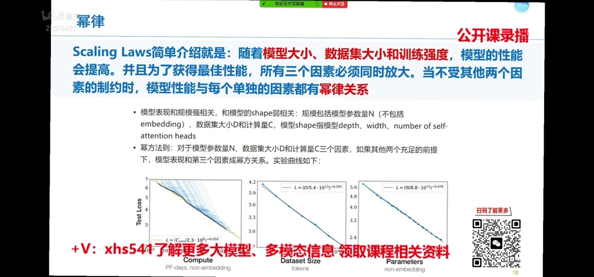
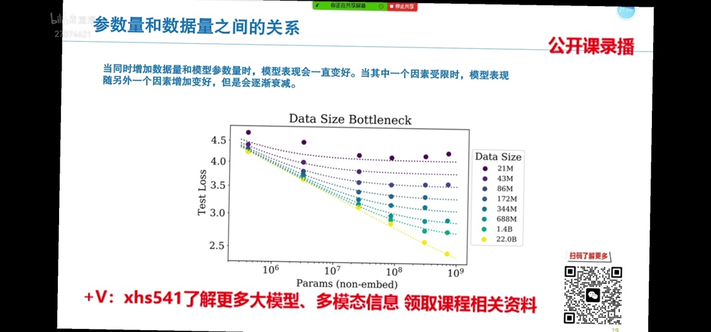
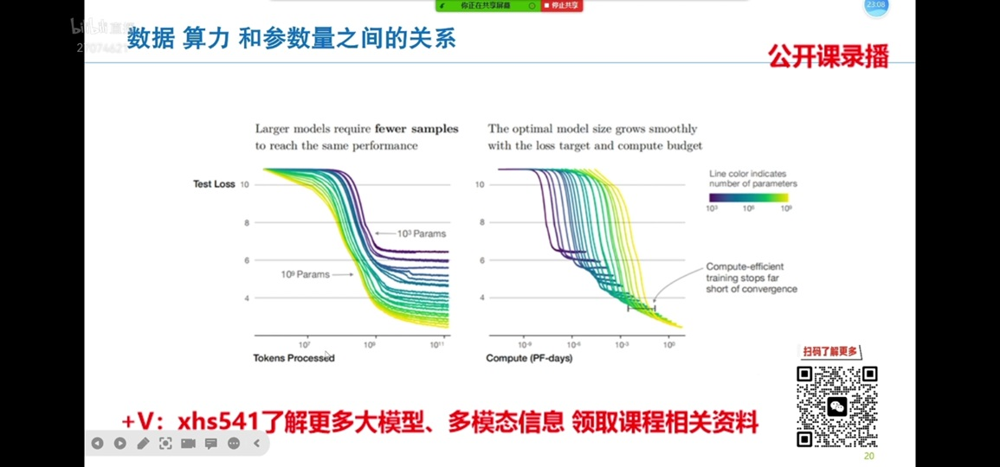

# Scaling Law[10]
### Scaling Law

### 参数量 vs 数据量

### 参数量 vs 数据量

# 参考
### Scaling Law
10. [解析大模型中的Scaling Law](https://zhuanlan.zhihu.com/p/667489780)  
1xx. [论文阅读，大模型的缩放定律，Scaling Laws for Neural Language Models](https://zhuanlan.zhihu.com/p/663296750)  
2xx. [Training Compute-Optimal Large Language Models 简读 ](https://finisky.github.io/training-compute-optimal-large-language-models-summary/)  

2xx. [【预训练模型】推翻OpenAI结论, DeepMind重新定义预训练的训练参数和训练规模的关系！](https://zhuanlan.zhihu.com/p/536053110)  
《Scaling Laws for Neural Language Models》  
《Training Compute-Optimal Large Language Models》  
