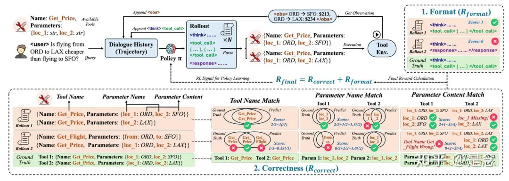

# 论文

[**ToolRL: Reward is All Tool Learning Needs**](https://arxiv.org/abs/2504.13958)

为了确定最佳奖励策略，探索了四个关键维度的各种奖励配置：(1) 奖励类型（奖励哪些方面），(2) 奖励尺度（奖励多少），(3) 奖励粒度（奖励信号的详细程度），以及 (4) 奖励动态（奖励如何随时间演变）。通过大量的实验确定了最符合主体工具使用情况的奖励设计，并揭示了奖励对于调用工具的 LLM 而言“有用”的原因。论文得出的核心见解总结如下：

- 推理轨迹越长并不一定越好，而且过长的奖励可能会降低性能。
- 动态奖励尺度有助于模型从简单行为平稳过渡到复杂行为。
- 细粒度的奖励分解可实现更稳定、更有效的学习。

论文得出的核心见解总结如下：

- 推理轨迹越长并不一定越好，而且过长的奖励可能会降低性能。
- 动态奖励尺度有助于模型从简单行为平稳过渡到复杂行为。
- **细粒度的奖励分解**可实现更稳定、更有效的学习。

**Format Reward** 

**Correctness Reward**

#  参考
[2025年大模型agent rl训练多轮planning技术TORL,ToolRL, RAGEN,OTC,SkyRL-v0, GiGPO,Tool-N1 ,ARTIST, ZeroTIR, GRPO](https://zhuanlan.zhihu.com/p/1902381952998281700)