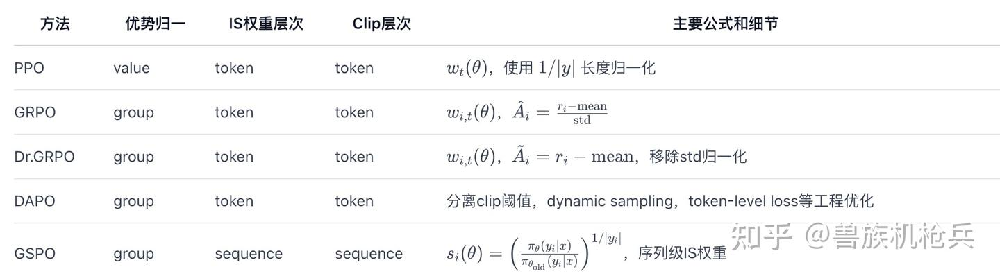

# 算法

| 算法     | 核心思想                                 | 是否使用评论家 | 主要创新点                       | 关键优势                      | 目标问题                       |
| -------- | ---------------------------------------- | -------------- | -------------------------------- | ----------------------------- | ------------------------------ |
| PPO      | 将策略更新限制在信任区域内以稳定学习。   | 是             | 截断代理目标函数。               | 稳定、鲁棒。                  | 通用RL对齐(RLHF)。             |
| DPO      | 通过分类损失直接在偏好对上优化策略。     | 否             | 将奖励重参数化为最优策略的函数。 | 简洁、稳定、无RM/RL循环。     | 通用RL对齐(RLHF)。             |
| GRPO     | 使用一组样本的奖励统计量来估计优势。     | 否             | 基于组的优势估计。               | 内存/计算效率高。             | 资源密集型的推理任务。         |
| DAPO     | 系统性地应用一套技术来解决大规模RL问题。 | 否             | Clip-Higher、动态采样等的组合。  | 解决特定的训练病理问题。      | 规模化训练的可扩展性和稳定性。 |
| Dr. GRPO | 从GRPO目标中移除已识别的长度和难度偏差。 | 否             | 无偏的损失函数形式。             | token效率更高，偏差更小。     | GRPO中的长度/难度偏差。        |
| GSPO     | 在序列级别执行重要性采样和截断。         | 否             | 序列级重要性采样。               | 极高的稳定性，尤其对MoE模型。 | token级更新的不稳定性。        |
| GMPO     | 使用奖励的几何平均值以对异常值保持鲁棒。 | 否             | 目标函数中使用几何平均。         | 对异常奖励值的鲁棒性。        | 奖励异常值导致的不稳定。       |
| GFPO     | 在更新前根据行为指标过滤采样的轨迹。     | 否             | 对轨迹进行拒绝采样。             | 生成简洁、高效的回答。        | 回答长度膨胀问题。             |
| LitePPO  | 组合归一化和损失聚合的最佳实践。         | 否             | 对现有技术的有原则配置。         | 以最小的复杂性实现高性能。    | RL流程中的过度工程化。         |

# 演化脉络
PPO：token-level，价值函数依赖，clip在token上。
GRPO：引入 group 原则，reward group内归一，无需value，但clip/S依然是token-level，variance大。
Dr.GRPO：修正GRPO的长度和方差归一偏置，不再token归一。
DAPO：进一步吸收众多工程技巧（Clip-Higher、Dynamic Sampling等）来缓解大模型RL的瓶颈，token-level范式不变。
GSPO：范式跃迁，off-policy与clip全部sequence-level，variance低，性能和算法纯粹性最佳，最新Qwen3 RL实践基础。

# 核心公式对照表

# 参考
[PPO、DPO、GRPO及其变体（Dr. GRPO、DAPO、GSPO、GMPO、GFPO、LitePPO）策略优化算法综述](https://zhuanlan.zhihu.com/p/1946231150822552323)
[PO 系列工作解析 (一)：从PPO到GRPO/DAPO/Dr.GRPO再到GSPO的演化](https://zhuanlan.zhihu.com/p/1941902507136746342)

