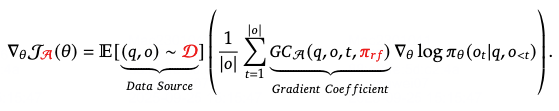
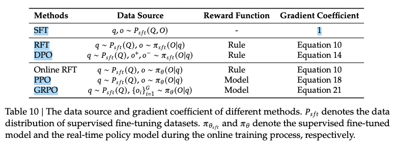
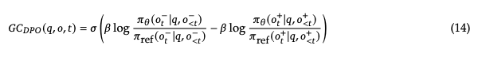
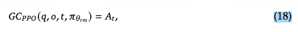
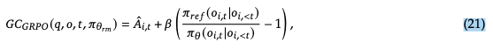

# RL unified paradigm

### RL unified paradigm

### DPO

### PPO

### GRPO

# 参考
[DeepSeekMath: Pushing the Limits of Mathematical Reasoning in Open Language Models](https://arxiv.org/abs/2402.03300)
